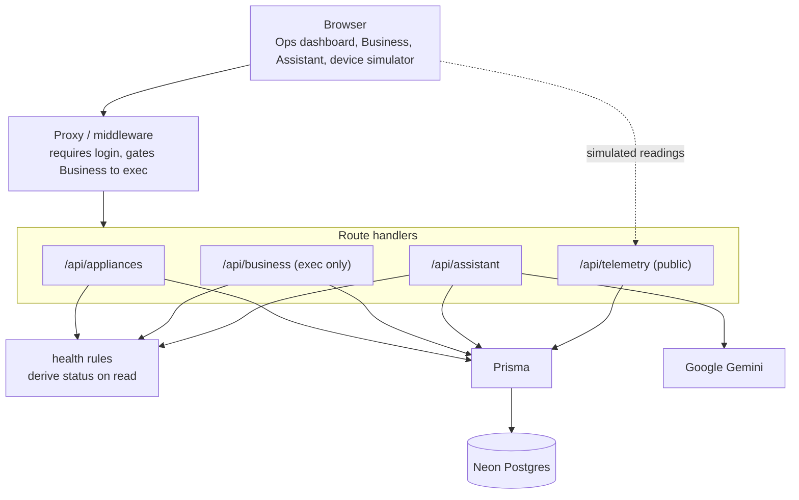

# SmartHQ Fleet

[](https://github.com/ngynjstn/smarthq-fleet/actions/workflows/ci.yml)

A monitoring dashboard for a fleet of connected GE appliances. It pulls live telemetry from each unit, works out the health of every appliance on the fly, and flags problems before they turn into failures. There is a role-aware business view that turns those health states into dollars, and an AI assistant that answers questions about the fleet in plain English.

I built this as a portfolio project to show I can take an idea end to end: data model, real-time UI, auth, role-based access, an LLM feature, and a real deployment.

**Live demo:** https://smarthq-fleetjn.vercel.app

You can sign in with any Google account. You will land in the Ops view as a standard user. The Business view with the financial numbers is restricted to exec accounts, so that tab will not show up for a normal login.


## What it does

- **Live fleet dashboard.** Every appliance shows its current status (healthy, warning, critical, offline), the metric it is being judged on, and a plain-English reason. The page refreshes on its own every few seconds.
- **Health is computed, not stored.** I never write a status into the database. Every time the fleet is read, the latest readings get run through a set of rules and the verdict comes out fresh. That way a status can never go stale or disagree with the data behind it.
- **Predictive, not just reactive.** The interesting part. Most of the rules are threshold checks (an oven over 300C is critical). But the refrigerator also watches the temperature trend: if the temp is climbing steadily, it gets flagged for possible compressor wear while it is still inside the safe range. The point is to catch a unit that is on its way to failing, not just one that already failed.
- **Business view (exec only).** The same health states rolled up into money: estimated savings from catching issues early, cost at risk from units running to failure, how many issues were caught early, and fleet uptime. This view and its API are locked to exec accounts.
- **AI assistant.** Ask questions like "what should I be worried about right now?" and get an answer grounded in the actual current fleet snapshot. It is told to answer only from the data it is given and never make up numbers. Exec users get the dollar figures in the assistant's context; standard users do not.
- **Telemetry ingestion.** A simple endpoint that takes a reading, validates it, and stores it, which is what a real device would post to.

## The predictive maintenance angle

This is the idea I care about most. Reactive monitoring tells you the fridge is too warm after the food has already spoiled. Predictive monitoring tells you the compressor is degrading while the fridge is still cold enough, so you can schedule a planned repair instead of eating an emergency one.

The fridge rule looks at the recent temperature readings and measures the trend across them. A sustained rise gets flagged as a warning ("temp rising, possible compressor wear") even though the absolute temperature is still fine. The cost model puts a number on that: an unplanned refrigerator failure runs about $900 including food spoilage, a planned repair about $250, so every early catch is roughly $650 saved.

## Architecture



Every request except the telemetry endpoint and the auth routes goes through the proxy, which bounces anyone who is not logged in and keeps non-exec users out of the Business view. The route handlers load the fleet, run it through the health rules, and return the result. The assistant builds a text snapshot of that same fleet and hands it to Gemini.

## Tech stack

- **Next.js (App Router) and TypeScript** for the app, both UI and API.
- **Prisma** as the ORM, pointed at **Neon Postgres** (serverless).
- **Auth.js (NextAuth) with Google OAuth.** Sessions are JWTs and carry the user's role. The auth config is split so the adapter-free part can run in the edge proxy and the full part with the database adapter runs on the server.
- **Tailwind CSS** for the UI.
- **Google Gemini** (`@google/genai`) for the assistant.
- **Vercel** for hosting.

## Project structure

```
src/
  app/
    page.tsx                  Ops dashboard
    business/page.tsx         exec-only business view
    assistant/page.tsx        assistant UI
    api/
      appliances/route.ts     fleet with live health
      business/route.ts       business KPIs (exec)
      assistant/route.ts      question -> grounded Gemini answer
      telemetry/route.ts      device reading ingestion
  lib/
    health.ts                 the health rules (pure)
    business.ts               health -> business KPIs
    costs.ts                  the cost model
    fleet.ts                  load the fleet + attach health
    assistant.ts              build the fleet snapshot for the LLM
    simulate.ts               per-type reading generator
    prisma.ts                 Prisma client
  components/
    TelemetrySimulator.tsx    posts simulated readings while a tab is open
    AuthButton.tsx
  auth.ts                     full auth (with DB adapter)
  auth.config.ts             edge-safe auth (providers + callbacks)
  proxy.ts                   middleware: login + role gate
prisma/
  schema.prisma
  seed.ts
scripts/
  set-role.ts                admin tool to set a user OPS/EXEC
```

## Design decisions worth calling out

- **Derive health on read instead of storing it.** Health is a function of the latest readings, so I compute it every time rather than persisting a status that could drift out of sync with the data.
- **Role-gated assistant context.** The assistant only sees the dollar figures if the user is an exec. The gate is in the data the model is handed, not just in the UI, so a standard user cannot get the financials out of it by asking cleverly.
- **A browser simulator instead of a cron job.** Vercel's free tier only allows cron jobs to run once a day, which is far too slow to keep readings inside the staleness window. So instead, while the dashboard is open, the browser acts as a set of devices and posts fresh readings to the same telemetry endpoint a real device would use. The deployed app looks live the moment you open it.
- **Postgres over SQLite.** The project started on SQLite locally, but `better-sqlite3` is a native module writing to a local file, which does not work on Vercel's serverless functions. Moving to Neon Postgres was a prerequisite for deploying.

## How I'd productionize this

This is a portfolio build, not a fleet of real appliances. Here is how I would take it from a browser-driven simulator to millions of connected units, and — honestly — what is implemented today versus what is future work.

**Ingestion: replace browser posts with an event stream.**
*Today:* the browser acts as a set of devices and `POST`s one reading at a time to a public HTTPS endpoint, which a serverless function validates with zod and writes straight to Postgres. (Vercel's free cron only fires once a day, far too slow to keep readings fresh, so I pushed "liveness" into the browser.)
*Future:* real devices push continuously and in bursts. I'd put a managed event stream/queue in front — Kafka, Kinesis, or Pub/Sub — that devices (or an edge gateway) publish to. Stream consumers then validate, batch, and persist. That decouples spiky device traffic from the database and buys buffering, backpressure, replay, and at-least-once delivery. The HTTP route shrinks to a thin authenticated ingest gateway that validates and enqueues.

**Storage: partition telemetry as time-series.**
*Today:* a single `Reading` table indexed on `(applianceId, recordedAt)` — fine for four appliances.
*Future:* telemetry is high-volume, append-only, time-ordered. I'd partition/shard by appliance and time window and move to a time-series store (Timescale hypertables or native Postgres time partitioning, or a purpose-built TSDB), with retention and downsampling — keep raw readings for N days, roll older data up.

**Fast reads while keeping "computed on read = never stale."**
*Today:* every read recomputes health from the latest readings. Correct and never stale, but it re-queries the last 20 readings per appliance on every request — read amplification that won't hold at millions of units.
*Future:* a stream processor maintains a rolling per-appliance health rollup (latest value, recent trend) updated as readings arrive, and dashboards read that rollup instead of scanning raw rows. The key is that the rollup runs the **same** `evaluateHealth` logic in the consumer, so it's a pure function of the readings — a cache that's always re-derivable by replaying the stream and can never silently disagree with the data. That preserves the "derive health, never hand-set a status" principle while making reads cheap.

**Observability (not implemented yet — stated plainly).**
*Today:* effectively none. There's a `console.error` on the assistant's failure path and nothing else — no metrics, tracing, or alerting.
*Future:* structured logs with request IDs; error tracking (e.g. Sentry); metrics for ingest rate, write latency, per-status fleet counts, and offline/staleness rate; and alerting on SLOs like ingest lag, error rate, and fraction of fleet offline. For a system whose whole point is reliability, this is table stakes, and I'm calling out that the demo doesn't have it.

**Auth & security for device-to-cloud.**
*Today:* `/api/telemetry` is public and unauthenticated — anyone can `POST` a reading. Acceptable for a browser sim, not for real hardware.
*Future:* per-device identity and credentials (mutual TLS / device certs, or signed tokens), authenticate every ingest, authorize each device to write only its own appliance's data, rate-limit, and keep validating payloads. This mirrors how the real SmartHQ platform works (OAuth2 with per-device identity), discussed next.

## How faithful is the simulator to the real SmartHQ API?

I looked at the [SmartHQ developer portal](https://developer.smarthq.com/) and the public reverse-engineered community SDKs (e.g. [simbaja/gehome](https://github.com/simbaja/gehome)) to be able to speak to this honestly.

**The real SmartHQ model.** Appliances expose state as **ERD** (key-value) properties: keys are hex codes (e.g. `0x5205`), values are hex-encoded strings (e.g. `"002d"` = 45), JSON-encoded like `{"0x5205":"002d"}`. State changes are **pushed** device→cloud over XMPP / a websocket ("MQTT"), with a REST API exposing the same ERDs and a `GET /UUID/cache` returning all current values. Devices are identified by MAC / JID / UUID, and access is via OAuth2.

**My simulator.** A device `POST`s `{ applianceId, metric, value }` to `/api/telemetry`, where `metric` is a readable enum (`TEMP_C`, `VIBRATION_MM_S`, …) and `value` is an already-decoded number in engineering units. It's stored as a `Reading` row with a server-side `recordedAt`.

**Where it already resembles SmartHQ**
- Same core shape: a single property key + value pushed from device to cloud. My `{ metric, value }` ≈ one ERD `{ code: value }`; one reading per `POST` ≈ one ERD `PUBLISH`.
- Push, not poll — the browser pushes fresh readings the way real devices `PUBLISH` ERD updates.
- Appliances carry a real GE model number (e.g. `PFE28KYNFS`) and a stable identifier.

**Where it diverges**
- **Encoding:** I use readable metric names and decoded numeric values; SmartHQ uses opaque hex ERD codes and hex-string values that need decoding.
- **Identity:** my `applianceId` is a database `cuid`; SmartHQ uses MAC/JID/UUID hardware identity.
- **Transport & auth:** I use a single public HTTPS `POST` per reading; SmartHQ uses XMPP/websocket + REST behind OAuth2 with per-device identity.
- **No full-state snapshot:** there's no equivalent of SmartHQ's `GET /UUID/cache`.

**Smallest faithful changes — and why I didn't make all of them.** I deliberately did *not* adopt hex ERD codes: the readable metric enum is wired into the pure health rules and their unit tests, so swapping to hex would cost readability and add a decode layer for zero functional gain in a simulator. The genuinely low-risk improvements that wouldn't touch the rules — carrying a device-level hardware ID, and putting the ingest endpoint behind per-device auth — are captured as future work in "How I'd productionize this" above rather than half-implemented here.

> **In one honest sentence:** my simulator mirrors the real SmartHQ shape at the conceptual level — a single key-value property pushed from device to cloud — but uses readable metric names and decoded engineering units instead of SmartHQ's hex ERD codes.
>
> **Why simulate at all:** using readable metrics and decoded values keeps the whole health pipeline deterministic and unit-testable, which is exactly why I could pin every threshold and the predictive trend in the test suite.

## Running it locally

You will need a Postgres database (Neon's free tier works), a Google OAuth client, and a Gemini API key.

```bash
git clone https://github.com/ngynjstn/smarthq-fleet.git
cd smarthq-fleet
npm install
```

Create a `.env` with:

```
DATABASE_URL=        # pooled Postgres connection string
DIRECT_URL=          # direct (unpooled) connection, used for migrations
AUTH_SECRET=         # any random secret
AUTH_GOOGLE_ID=      # Google OAuth client id
AUTH_GOOGLE_SECRET=  # Google OAuth client secret
GEMINI_API_KEY=      # Google Gemini key
```

Then set up the database and start the app:

```bash
npx prisma migrate dev
npx prisma db seed
npm run dev
```

The seed creates the four appliances but no readings, so everything reads as offline until the browser simulator starts posting telemetry. Open the dashboard and the fleet comes to life within a few seconds.

To give yourself the exec role and unlock the Business view:

```bash
node --import tsx scripts/set-role.ts you@example.com EXEC
```

Sign out and back in afterward so the new role makes it into your session.
