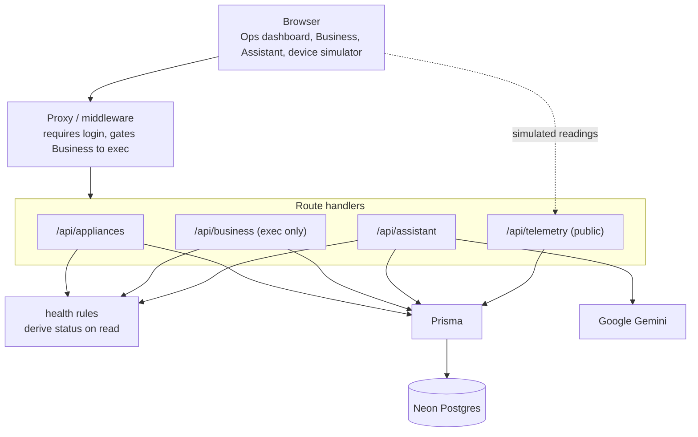

# SmartHQ Fleet

A monitoring dashboard for a fleet of connected GE appliances. It pulls live telemetry from each unit, works out the health of every appliance on the fly, and flags problems before they turn into failures. There is a role-aware business view that turns those health states into dollars, and an AI assistant that answers questions about the fleet in plain English.

I built this as a portfolio project to show I can take an idea end to end: data model, real-time UI, auth, role-based access, an LLM feature, and a real deployment.

**Live demo:** https://smarthq-fleetjn.vercel.app

You can sign in with any Google account. You will land in the Ops view as a standard user. The Business view with the financial numbers is restricted to exec accounts, so that tab will not show up for a normal login.


## What it does

- **Live fleet dashboard.** Every appliance shows its current status (healthy, warning, critical, offline), the metric it is being judged on, and a plain-English reason. The page refreshes on its own every few seconds.
- **Health is computed, not stored.** I never write a status into the database. Every time the fleet is read, the latest readings get run through a set of rules and the verdict comes out fresh. That way a status can never go stale or disagree with the data behind it.
- **Predictive, not just reactive.** The interesting part. Most of the rules are threshold checks (an oven over 300C is critical). But the refrigerator also watches the temperature trend: if the temp is climbing steadily, it gets flagged for possible compressor wear while it is still inside the safe range. The point is to catch a unit that is on its way to failing, not just one that already failed.
- **Business view (exec only).** The same health states rolled up into money: estimated savings from catching issues early, cost at risk from units running to failure, how many issues were caught early, and fleet uptime. This view and its API are locked to exec accounts.
- **AI assistant.** Ask questions like "what should I be worried about right now?" and get an answer grounded in the actual current fleet snapshot. It is told to answer only from the data it is given and never make up numbers. Exec users get the dollar figures in the assistant's context; standard users do not.
- **Telemetry ingestion.** A simple endpoint that takes a reading, validates it, and stores it, which is what a real device would post to.

## The predictive maintenance angle

This is the idea I care about most. Reactive monitoring tells you the fridge is too warm after the food has already spoiled. Predictive monitoring tells you the compressor is degrading while the fridge is still cold enough, so you can schedule a planned repair instead of eating an emergency one.

The fridge rule looks at the recent temperature readings and measures the trend across them. A sustained rise gets flagged as a warning ("temp rising, possible compressor wear") even though the absolute temperature is still fine. The cost model puts a number on that: an unplanned refrigerator failure runs about $900 including food spoilage, a planned repair about $250, so every early catch is roughly $650 saved.

## Architecture



Every request except the telemetry endpoint and the auth routes goes through the proxy, which bounces anyone who is not logged in and keeps non-exec users out of the Business view. The route handlers load the fleet, run it through the health rules, and return the result. The assistant builds a text snapshot of that same fleet and hands it to Gemini.

## Tech stack

- **Next.js (App Router) and TypeScript** for the app, both UI and API.
- **Prisma** as the ORM, pointed at **Neon Postgres** (serverless).
- **Auth.js (NextAuth) with Google OAuth.** Sessions are JWTs and carry the user's role. The auth config is split so the adapter-free part can run in the edge proxy and the full part with the database adapter runs on the server.
- **Tailwind CSS** for the UI.
- **Google Gemini** (`@google/genai`) for the assistant.
- **Vercel** for hosting.

## Project structure

```
src/
  app/
    page.tsx                  Ops dashboard
    business/page.tsx         exec-only business view
    assistant/page.tsx        assistant UI
    api/
      appliances/route.ts     fleet with live health
      business/route.ts       business KPIs (exec)
      assistant/route.ts      question -> grounded Gemini answer
      telemetry/route.ts      device reading ingestion
  lib/
    health.ts                 the health rules (pure)
    business.ts               health -> business KPIs
    costs.ts                  the cost model
    fleet.ts                  load the fleet + attach health
    assistant.ts              build the fleet snapshot for the LLM
    simulate.ts               per-type reading generator
    prisma.ts                 Prisma client
  components/
    TelemetrySimulator.tsx    posts simulated readings while a tab is open
    AuthButton.tsx
  auth.ts                     full auth (with DB adapter)
  auth.config.ts             edge-safe auth (providers + callbacks)
  proxy.ts                   middleware: login + role gate
prisma/
  schema.prisma
  seed.ts
scripts/
  set-role.ts                admin tool to set a user OPS/EXEC
```

## Design decisions worth calling out

- **Derive health on read instead of storing it.** Health is a function of the latest readings, so I compute it every time rather than persisting a status that could drift out of sync with the data.
- **Role-gated assistant context.** The assistant only sees the dollar figures if the user is an exec. The gate is in the data the model is handed, not just in the UI, so a standard user cannot get the financials out of it by asking cleverly.
- **A browser simulator instead of a cron job.** Vercel's free tier only allows cron jobs to run once a day, which is far too slow to keep readings inside the staleness window. So instead, while the dashboard is open, the browser acts as a set of devices and posts fresh readings to the same telemetry endpoint a real device would use. The deployed app looks live the moment you open it.
- **Postgres over SQLite.** The project started on SQLite locally, but `better-sqlite3` is a native module writing to a local file, which does not work on Vercel's serverless functions. Moving to Neon Postgres was a prerequisite for deploying.

## Running it locally

You will need a Postgres database (Neon's free tier works), a Google OAuth client, and a Gemini API key.

```bash
git clone https://github.com/ngynjstn/smarthq-fleet.git
cd smarthq-fleet
npm install
```

Create a `.env` with:

```
DATABASE_URL=        # pooled Postgres connection string
DIRECT_URL=          # direct (unpooled) connection, used for migrations
AUTH_SECRET=         # any random secret
AUTH_GOOGLE_ID=      # Google OAuth client id
AUTH_GOOGLE_SECRET=  # Google OAuth client secret
GEMINI_API_KEY=      # Google Gemini key
```

Then set up the database and start the app:

```bash
npx prisma migrate dev
npx prisma db seed
npm run dev
```

The seed creates the four appliances but no readings, so everything reads as offline until the browser simulator starts posting telemetry. Open the dashboard and the fleet comes to life within a few seconds.

To give yourself the exec role and unlock the Business view:

```bash
node --import tsx scripts/set-role.ts you@example.com EXEC
```

Sign out and back in afterward so the new role makes it into your session.
